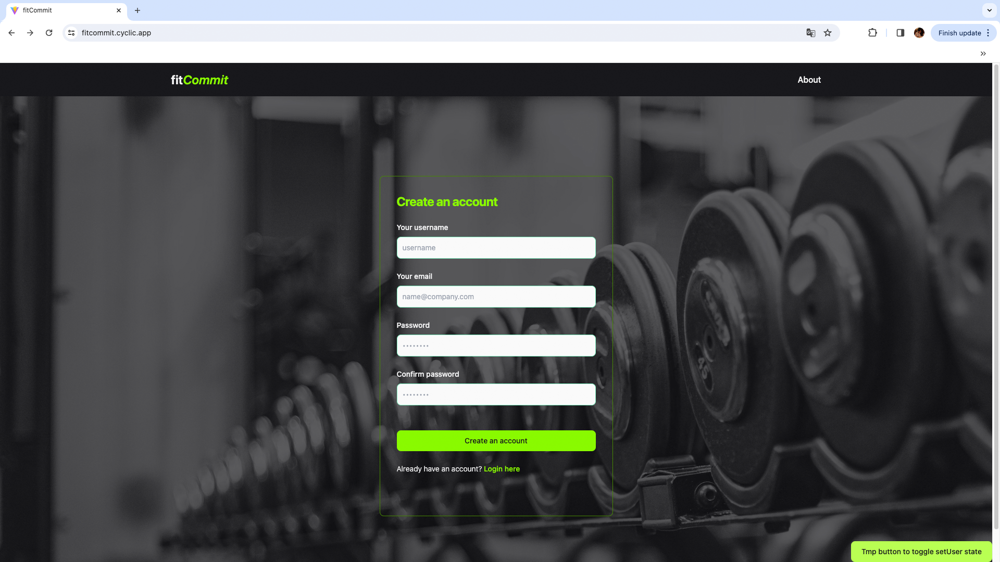
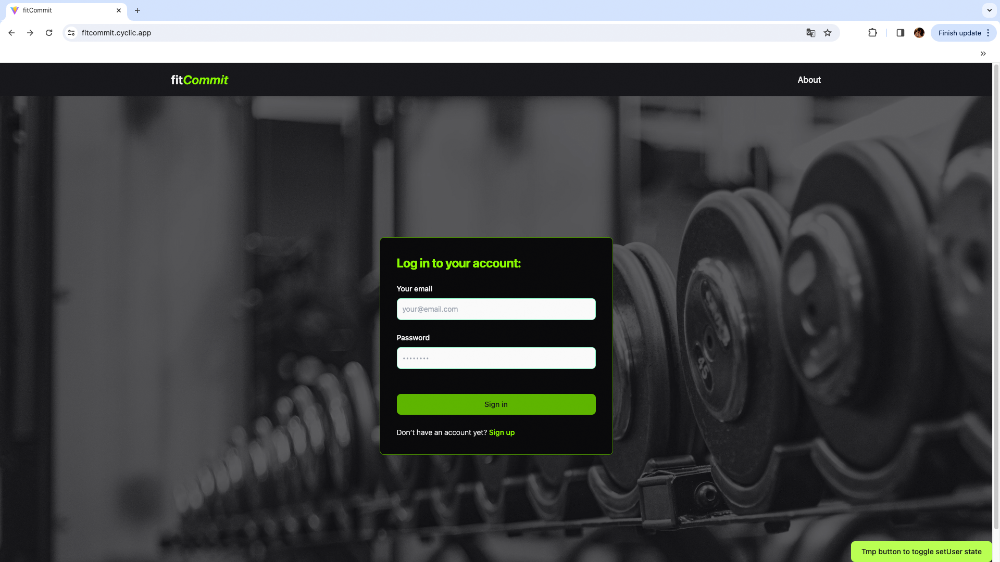
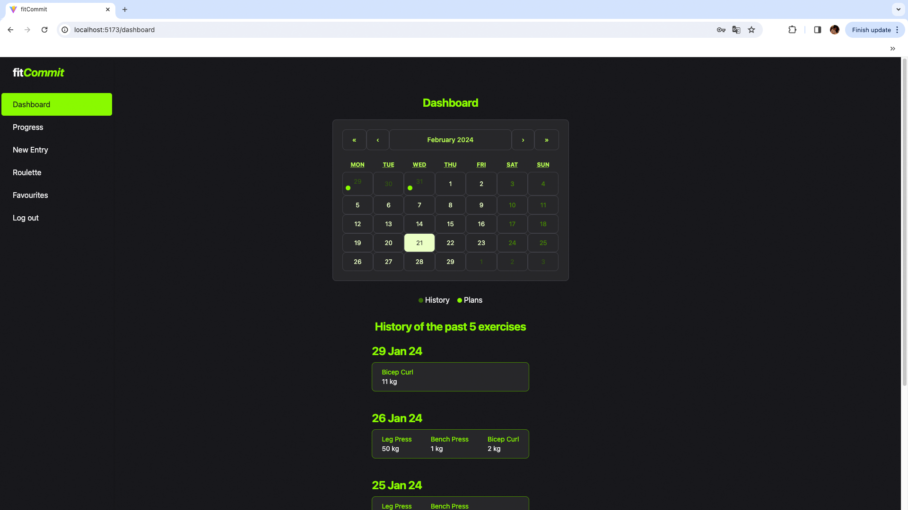
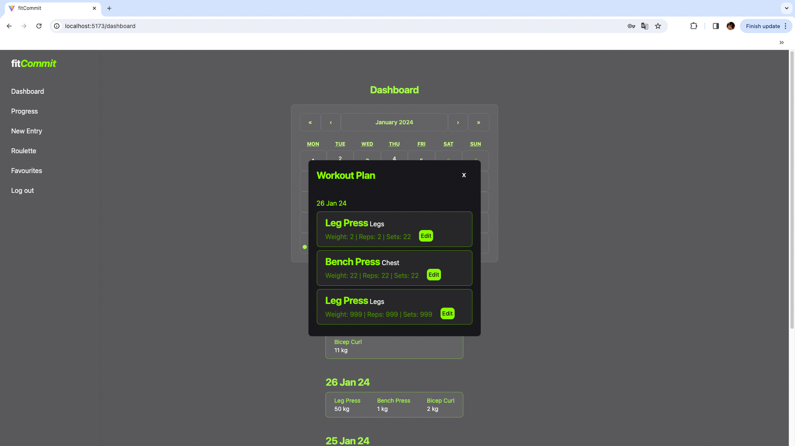
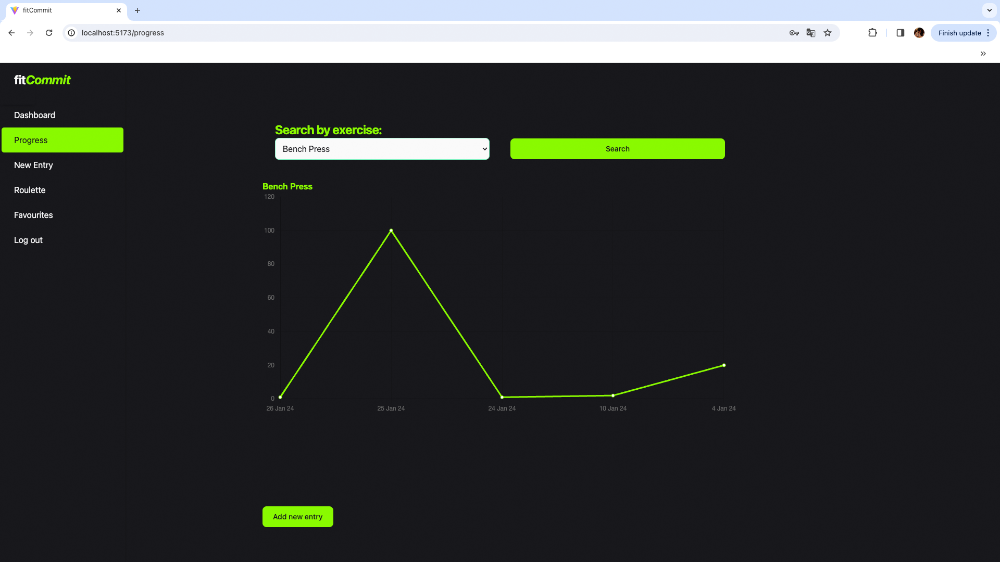
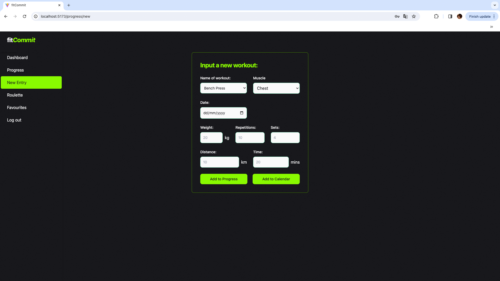
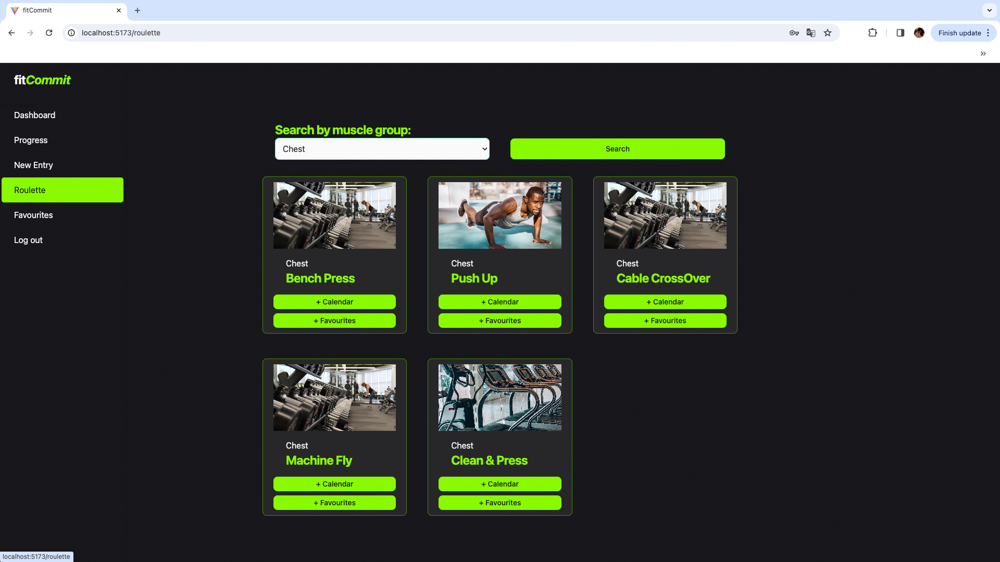
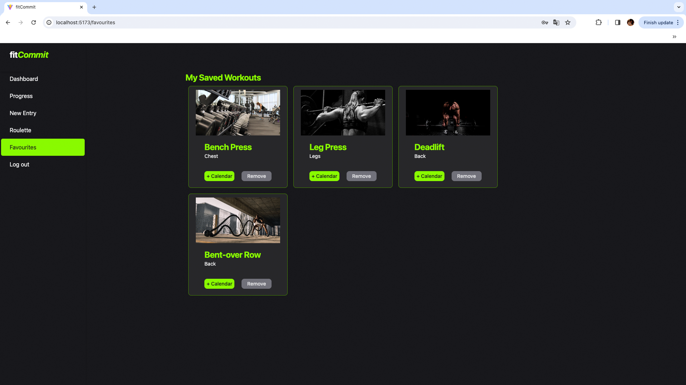

# fitCommit

A fitness tracking application to empower gym goers beyond their limits.
https://fitcommit.cyclic.app/

This project was jointly developed by:
Joey (frontend), Bobby (auth pages), Jonathan (backend)

## Features

Gym goers can utilise fitCommit to plan their workout with the Calendar feature, view their most recent exercises and use the progress chart track their maximum weight per exercise over time. Roulette feature provides inspiration for exercises which users can add to their favourites and future workout plan.

### Sign up for an account

- Users can sign up for an account. Password is hashed and authentication is done with JSON Web Token.
  
  

### Dashboard

- Displays calendar of scheduled workout and workout history
- View or modify scheduled workout

### Track your progress

- A line chart to monitor progress of strength training

### Add workout

- Add a workout to calendar or favorites

### Lack of inspiration?

Roulette for workout inspiration and option to add to calendar or favourites

